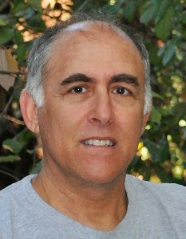

---
**M**atthew is a talented and creative photographer dedicated to using his talents and skills in photography, and love for architecture, to provide high quality images for the Real Estate Market.

Matthew strives to capture, not just the visual appearance of a building, but something of the intent of the architect and feeling of the structure or interior.

Matthew is easy to work with and provides great support for marketing Real Estate Properties.

Matthew’s journey into photography started at a very young age when his father took him to Philadelphia to buy his first camera; a twin-lens reflex. He still has it. It was with that camera that Matthew began to discover the wonders of the play of light and the freezing of time with the click of the shutter. It was the Golden Age of Photography, when film had to be developed, and images emerged from a piece of white paper in a bath of chemicals. Matthew spent hours in the darkroom he set up in his basement, refining his art.

Later Matthew attended the University of Delaware where he received a BA in Fine Art, with an emphasis in photography. His photos were selected to illustrate a brochure produced by the University. He has always had a love for architecture and considered becoming an architect.

As Matthew’s life progressed, the need to actually make a living moved him into other areas of interest that were more marketable. Matthew went back to school and earned an AA in Computer Electronics, eventually becoming a software engineer.

During this time Matthew’s love for photography was always present. Recently the idea of using his photography skills and passion for architecture came up as a way to combine Matthew’s love for photography and passion for architecture in a way to provide a service to help people. Thus was born Matt Hoffman Photography.

